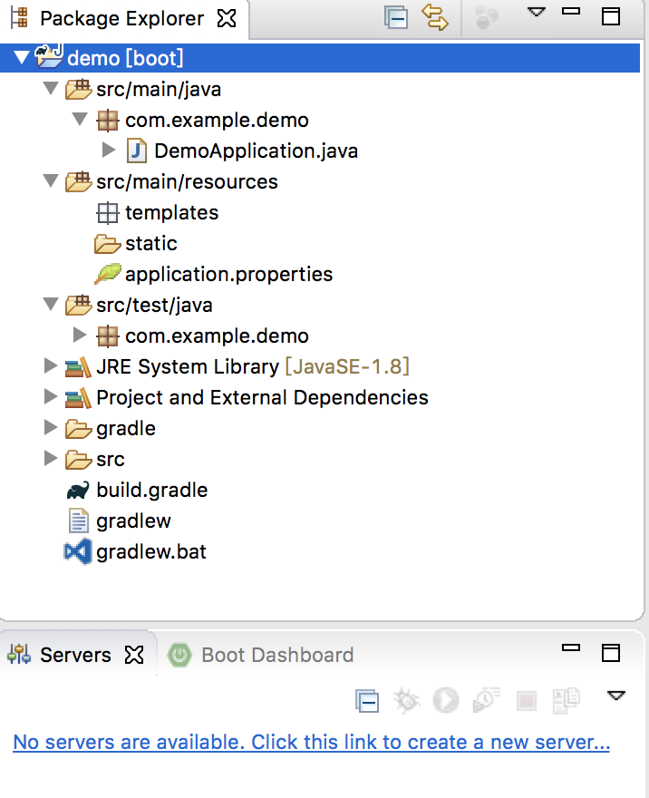
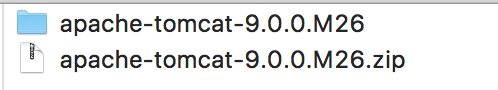
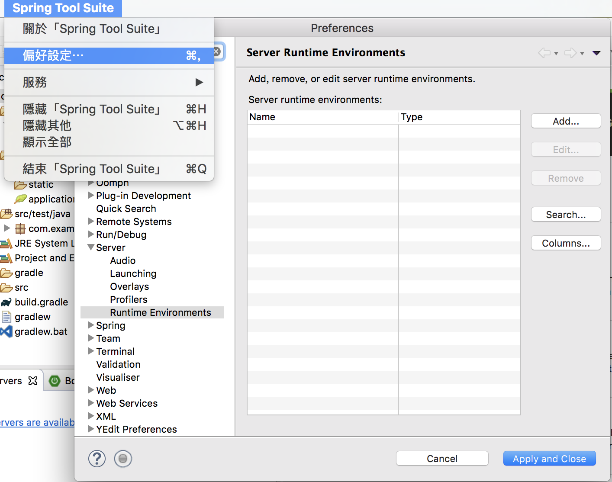
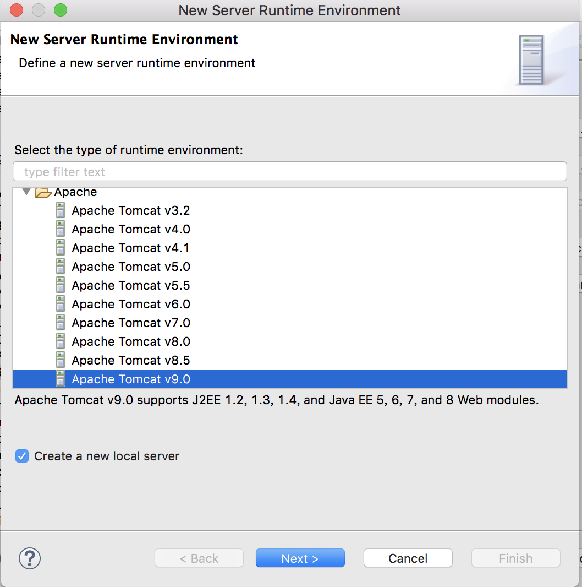
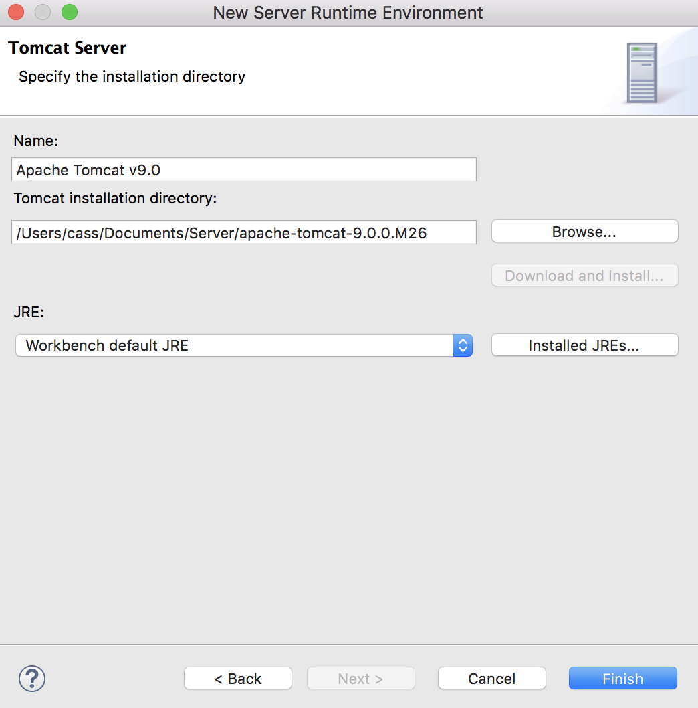

## 沒裝過Server Runtime Environments {#server-runtime-environments}

---

## 情境

* 如下圖Servers欄位顯示 **No servers are available **需要自行下載欲使用的Server

## 下載

* 此例中選用Tomcat
  * 下載安裝Tomcat 9 [http://tomcat.apache.org/](http://tomcat.apache.org/)
  * Mac選：Core &gt; zip
  * 下載到適當目錄並解壓縮

## 安裝

1. 偏好設定 &gt; Server &gt; Runtime Environments &gt; Add … \(都在下圖中\) 

2. 選擇下載要使用的Apache Tomcat版本，  
   選Apache &gt; Apache Tomcat v9.0

3. 指定先前解壓縮位址 &gt; Finish

4. 安裝完成  
   

