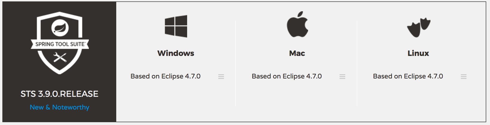
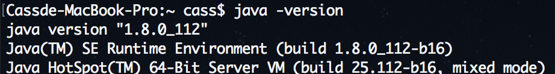
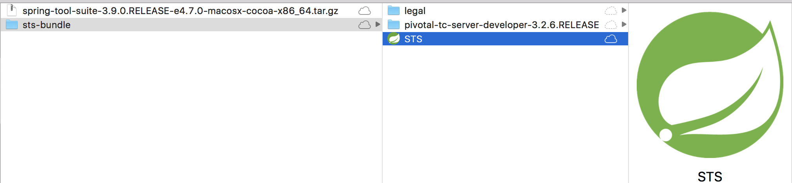
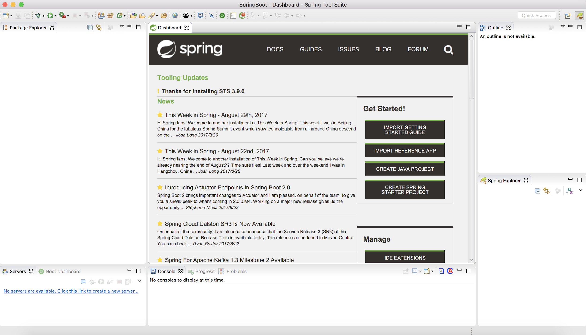
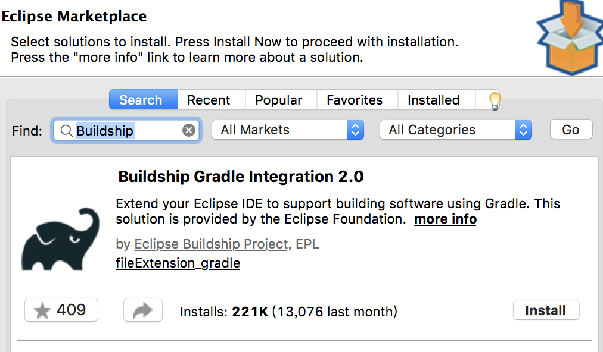

# 環境

---

### 開發工具

可採用Eclipse / Intellij IDEA / Spring Tool Suite

本範例使用Spring Tool Suite，以下簡稱STS來介紹。

#### 使用之環境資訊

* 現行版本為3.9.0

  * 基於Eclipse 4.7.0開發

* 搭配的套件管理使用Gradle

* 此範例使用Java 8

版本連結： [http://spring.io/tools/sts/all](#)請選擇合適的版本下載安裝

# 安裝

---

## 步驟

1. Java 8
   1. 進入終端機使用 java -version檢查版本
   2. [http://www.oracle.com/technetwork/java/javase/downloads/jdk8-downloads-2133151.html](http://www.oracle.com/technetwork/java/javase/downloads/jdk8-downloads-2133151.html)
   3. 找和STS一樣的版本\(x86 / x64\)，自行安裝之。
2. 下載並安裝STS\(Spring Tool Suite\)
   1. [http://spring.io/tools/sts](http://spring.io/tools/sts)
   2. 使用方式同Eclipse
   3. 以mac為例，下載檔案：spring-tool-suite-3.9.0.RELEASE-e4.7.0-macosx-cocoa-x86\_64.tar.gz
   4. 解壓縮出sts-bundle目錄，下圖STS即為可執行入口

* 1. 執行STS，選擇WorkSpace位置後進入開發環境（下圖）
* 安裝Gradle  
  1.  打開sts，前往Help &gt; Eclipse Marketplace 安裝Gardle \(請搜尋 Buildship Gradle\)  
  2.  下載Buildship Gradle Integration（參考下圖）

* 下載完成後重新啟動sts

