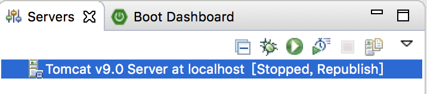

## 沒裝過Server Runtime Environments {#server-runtime-environments}

*   1.  情況如下圖 No servers are available：
    2.  下載安裝Tomcat 9 [http://tomcat.apache.org/](http://tomcat.apache.org/)
        1.  Mac選：Core &gt; zip
        2.  下載到適當目錄並解壓縮

*   1.  偏好設定 &gt; Server &gt; Runtime Environments &gt; Add … (都在下圖中) 
    2.  選擇下載要使用的Apache Tomcat版本

*   1.  選Apache &gt; Apache Tomcat v9.0
    2.  指定先前解壓縮位址

*   1.  安裝完成